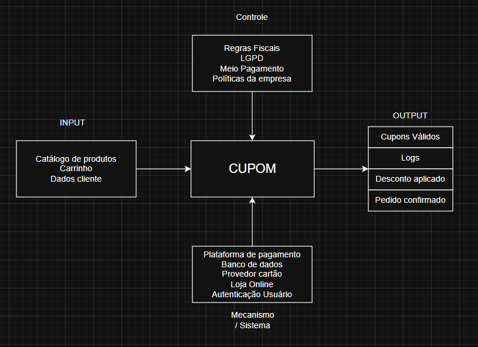

No modelo, o cupom recebe algumas entradas parâmetros e regras:

### Entrada
- Dados do usuário
- Itens no carrinho
- Catálogo dos itens disponíveis no momento do pedido

### Regras de controle
- Regras da LGPD
- Regras de desconto
- Forma de pagamento (carao, pix, boleto)
- Regras fiscais

### Mecanismo
- Provedor de meio de pagamento ex: mercado pago
- Banco de dados
- Autenticação do usuário

E então, em seu output, temos como resposta:

### Output
- Cupom válido
- Desconto Aplicado
- Pedido realizado
- Logs de auditoria para controle

### Comprovação
